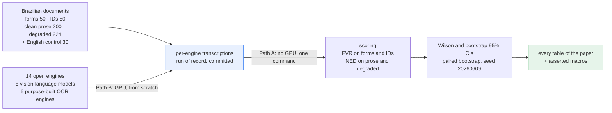
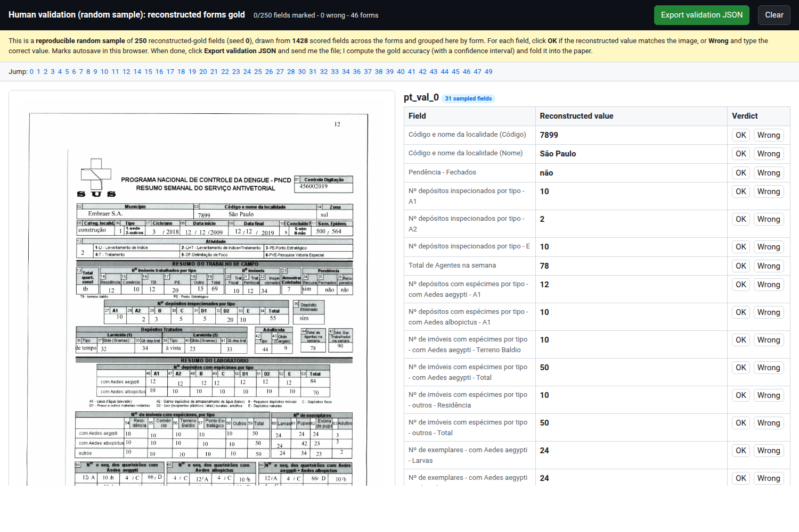

# Reading Brazil — a Brazilian-Portuguese OCR cost-versus-accuracy benchmark

A reproducible scoring harness for the first systematic OCR benchmark that pairs a
Brazilian-Portuguese **accuracy** axis with a local consumer-GPU **cost** axis across
the recent generation of open OCR engines. It scores **14 engines** (8 vision-language
models from 0.9B to 9B, five classical detect-then-recognize pipelines, and the
transformer-based Surya) on Brazilian forms, identity documents, clean Portuguese
prose, degraded scans, and an English control.
The headline: no class wins outright. An OCR engine (**Surya**, **0.921** field-value
recall on IDs) and a vision-language model (**Qwen2.5-VL**, **0.97** on forms and
**97.53** NED on degraded scans) are the only consistent all-rounders across the four
document types; neither leads all of them. This repository re-scores the
committed per-engine outputs offline, **asserts** the regenerated numbers are
identical to the paper's, and **emits every table of the paper** as readable
output. Two reproduce paths are provided: **(A)** a one-command, no-GPU path from
the pre-computed run of record, and **(B)** an optional GPU path that rebuilds the
per-engine outputs from scratch.

> **Paper:** Kapelinski, C., Lunkes, A., Welfer, D., Schmidt, D., Machado, B., and
> Kreutz, D. (2026). "Reading Brazil: A Local Cost-versus-Accuracy Benchmark of Open
> OCR Engines on Brazilian Documents." **ENIAC 2026, Undergraduate Track.**

**This README is the single self-contained guide a reviewer needs.** The files under
`docs/` (`PROTOCOL.md`, `DATASETS.md`, `ARCHITECTURE.md`) are complementary detail and
are not required to grant the seals.



*Path A is what a reviewer needs: it re-scores the committed transcriptions offline and
asserts every regenerated number against the paper. Path B rebuilds those transcriptions
on a GPU and is optional.*

## README structure

| Section | What it covers |
|---|---|
| [Considered seals](#considered-seals) | why each of the four seals holds |
| [Two reproduce paths](#two-reproduce-paths) | A (no GPU, one command, all tables) and B (GPU, from scratch) |
| [Make targets](#make-targets) | modular entry points |
| [Human validation](#human-validation-of-the-forms-gold) | two-annotator check of the reconstructed forms gold |
| [Basic information](#basic-information) | OS, runtime, RAM, disk, GPU |
| [Dependencies](#dependencies) | how the environment and inputs are obtained |
| [Security concerns](#security-concerns) | what runs locally and where data lives |
| [Installation](#installation) | clone + `uv sync` |
| [Minimal test](#minimal-test) | one command, end to end |
| [Experiments](#experiments) | the claims and how to reproduce each |
| [License](#license) | MIT |

## Considered seals

- **Disponível (SeloD):** public repository with an open MIT license and a DOI-able
  archive at camera-ready; everything needed to run is in the repository.
- **Funcional (SeloF):** one command (`./scripts/reproduce_from_results.sh`, or
  `make reproduce`) scores the committed run of record end to end, asserts the
  regenerated numbers against the paper, and prints **every table of the paper**
  (accuracy by engine, the local cost axis, and the per-degradation matrix); unit
  tests cover the metric logic and the table-vs-macro consistency.
- **Sustentável (SeloS):** packaged `src/` layout, one concern per module, typed public
  functions, pinned dependencies (`pyproject.toml` + committed `uv.lock`), tests and
  lint config; nothing is hardcoded to a host (all paths come from the environment).
- **Reprodutível (SeloR):** the no-GPU path re-scores the committed ESTER-Pt outputs
  live, regenerates the forms/IDs/EN numbers from the committed run of record, and
  recomputes four paired significance tests from committed PII-free arrays, then
  **asserts** every data-driven macro matches the paper's reference macro file at the
  printed precision; deterministic seeds (bootstrap seed `20260609`) make the confidence
  intervals exactly reproducible. No raw PII is needed or present.

## Two reproduce paths

The artifact has two modular paths to the same numbers; a reviewer only needs **A**.

- **Path A — from pre-computed results (no GPU, one command, emits every table).**
  `make reproduce` (= `./scripts/reproduce_from_results.sh`) re-scores the committed
  ESTER-Pt outputs live, regenerates the forms/IDs/EN/cost numbers and the four
  paired significance tests from the committed PII-free run of record, **asserts**
  every data-driven macro matches the paper's reference macro file, then prints the
  per-degradation matrix and **every table of the paper** (Tables 1–4) as readable
  output. Pure CPU, no network, ~1–4 min. The tables are built from the same
  consolidated results the macros come from, so there is a single source of truth.

- **Path B — from scratch (GPU, gated).** `make from-scratch`
  (= `./scripts/run_from_scratch.sh`) rebuilds the per-engine transcriptions from the
  models and documents on a CUDA GPU, then hands off to Path A to score and assert.
  A reviewer does **not** need this; the committed run of record reproduces every
  number and every table offline.

Every paper table is emitted by Path A:

| Table | Content | Source |
|---|---|---|
| Table 1 | positioning vs related OCR benchmarks (qualitative) | `results/positioning.json` |
| Table 2 | accuracy by engine (forms/IDs FVR, RIB/HYB NED%, 95% CIs), VLM \| OCR-engine | scored run of record |
| Table 3 | local cost axis — per-page latency (forms/IDs) with params + device, two panels | scored run of record |
| Table 4 | per-degradation NED matrix (14 engines × 8 DocCreator types) | scored run of record |

Standalone, the tables are also available with `make tables` (= `uv run ocr-bench
tables`); the LaTeX bodies the paper compiles come from `uv run ocr-bench tables --latex`.

## Make targets

A `Makefile` at the repo root wraps the scripts and CLI; each target is one line.

```
make help          # list the targets
make reproduce     # Path A: re-score, assert macros, print matrix + all tables (no GPU)
make tables        # print every paper table (Tables 1-4) from the committed results
make matrix        # print the per-degradation NED matrix (HYB axis)
make macros        # regenerate the data-driven LaTeX macros
make score         # score the run of record -> results/consolidated_results.json
make figure        # regenerate fig_frontier.pdf (adds the [figure] extra)
make from-scratch  # Path B: rebuild per-engine outputs on a GPU, then reproduce
make test          # run the unit + integration tests
make lint          # run ruff over src and tests
make all           # reproduce + tables + test
```

## Human validation of the forms gold

The Brazilian forms gold was reconstructed from the form images with **Claude Opus** (a large
multimodal model, **not** one of the evaluated engines), then **validated by two annotators
independently**: each checked the same reproducible random sample of **250** of the **1428**
scored fields against the images. Both found **no error** — field-level accuracy **1.00**, Wilson
95% interval **[0.985, 1.000]** (n = 250), with full agreement. The PII-free record is
[`results/forms_validation.json`](results/forms_validation.json), the method and provenance are in
[`docs/HUMAN_VALIDATION.md`](docs/HUMAN_VALIDATION.md), and the sample is regenerated by
[`scripts/validation/sample_validation_fields.py`](scripts/validation/sample_validation_fields.py)
(seed 0).



*The browser annotation tool: each sampled form's image beside its sampled fields, marked OK or
Wrong. The annotators' one discussed point was a representation choice, not an error — checkbox
marks (for example a consent form's seven `V` checklist items) are not encoded uniformly across
forms.*

## Basic information

| | Reference machine |
|---|---|
| OS | Linux x86-64 (Ubuntu 24.04 tested) |
| Runtime | Python >= 3.11, managed with `uv` |
| CPU | AMD Ryzen 7 9700X (8 cores / 16 threads) |
| RAM | 64 GB (the no-GPU path uses < 1 GB) |
| Disk | ~30 MB for the clone (the committed ESTER-Pt run of record is ~25 MB) |
| GPU | **none needed** for the reproduce path. The optional from-scratch path needs one NVIDIA RTX 5080 16 GB (or any >= 16 GB CUDA card) |

## Dependencies

The environment is managed with **`uv`**; you never build a virtualenv by hand. The
no-GPU reproduce path has a single runtime dependency, **`rapidfuzz`** (a fast C
Levenshtein backend that returns the identical distance to the bundled pure-stdlib
reference); the figure extra adds **`matplotlib`**. All versions are pinned in
`pyproject.toml` and frozen in the committed `uv.lock`.

The **inputs the reviewer needs are bundled**, but only the cleanly redistributable
subset is committed. For licence and privacy reasons (see `data/DATA-LICENSES.md`):

- **Committed (CC BY 4.0, no PII):** the ESTER-Pt RIB/HYB axis under `data/rib` and
  `data/hyb` (reference transcriptions, per-engine outputs, latency manifests). The
  no-GPU path **re-scores** these live.
- **Not redistributed:** the forms (XFUND), identity-document (BRIDP) and
  English-control (FUNSD) raw outputs and gold. Their gold carries
  synthetic-but-realistic PII (names, CPFs, e-mails, addresses, dates of birth) under
  restrictive licences (XFUND CC BY-NC-SA 4.0, FUNSD research-only, BRIDP unstated).
  Their **aggregate scores** are committed as the run of record
  (`results/run_of_record.json`, numbers only); the no-GPU path regenerates and
  **asserts** their macros from that file. These committed scores are the run of
  record for those axes. The four significance tests additionally ship PII-free
  per-unit arrays (`data/ids_pair_hits.json`, `data/forms_pair_hits.json`,
  `data/ids_pair_hits_surya_rapidocr.json`: only `0/1` hits and integer document
  indices; `data/hyb_pair_ned.json`: per-page NED% floats) so the paired bootstraps
  are recomputable too. MinerU's IDs FVR ships the same way: because BRIDP is never
  redistributed, `data/ids_mineru_hits.json` records only the `0/1` per-field hit
  (date-aware match) so the no-GPU path regenerates `\idsMineru` and its Wilson CI
  offline. MinerU's RIB/HYB outputs, by contrast, are committed under `data/rib`,
  `data/hyb` like every other engine (ESTER-Pt CC BY 4.0) and re-scored live.

The reviewer therefore downloads nothing. The from-scratch path fetches the source
inputs with `scripts/fetch_data.sh`; document **images** are never committed
(licence + size). See `docs/DATASETS.md`.

## Security concerns

- The reproduce path runs entirely **locally and offline**: it reads only the committed
  `data/` directory and `results/run_of_record.json`, and writes only under `results/`.
  No network access, no GPU, no external services.
- **No personal data is committed anywhere.** The committed tree holds only
  public-domain Portuguese literary text (ESTER-Pt, CC BY 4.0) and aggregate numbers
  (latency medians, per-engine scores). The forms/ids/en raw field values — which
  contain synthetic PII (names, CPFs, e-mails, addresses, dates of birth) — are **not**
  redistributed; only their aggregate scores are. The significance-test inputs
  (`data/ids_pair_hits.json`, `data/forms_pair_hits.json`,
  `data/ids_pair_hits_surya_rapidocr.json`, `data/hyb_pair_ned.json`) and MinerU's
  IDs hit array (`data/ids_mineru_hits.json`) are likewise PII-free: they hold only
  binary per-field hits (`0/1`) or per-page NED% floats and integer document
  indices, never a field value or transcription. The from-scratch path fetches the
  source inputs (`scripts/fetch_data.sh`) under each dataset's own licence.
- No credentials or secrets are used or stored. The optional from-scratch path downloads
  open model weights from Hugging Face into a cache directory you choose via `$HF_CACHE`.

## Installation

```bash
# 1. Clone
git clone <REPO_URL> ocr-ptbr-benchmark
cd ocr-ptbr-benchmark

# 2. Install uv (one line; skip if you already have it)
curl -LsSf https://astral.sh/uv/install.sh | sh

# 3. Create the pinned environment from uv.lock
uv sync
```

## Minimal test

One command (Path A) re-scores the committed run of record, regenerates the paper's
LaTeX macros, asserts they match the paper reference, then prints the per-degradation
matrix **and every table of the paper**:

```bash
make reproduce          # or: ./scripts/reproduce_from_results.sh
```

Expected output includes the assertion (the proof of reproduction):

```
      OK: all <N> regenerated macros match results_macros.reference.tex

PASS: reproduced the paper's numbers from the committed run of record.
```

then the per-engine × 8-degradation NED matrix (12 of the 14 engines carry the
breakdown — MinerU included; only Qwen3-VL and GLM-OCR report an overall HYB NED
without a per-degradation split), and finally the four paper tables (positioning,
accuracy by engine with 95% CIs, the local cost axis, and the per-degradation
matrix). **Expected time: ~1-2 min** (pure CPU, single thread). A non-zero exit
means at least one regenerated number differs from the paper and the mismatch is
printed. The tables alone are reprintable with `make tables`.

## Experiments

All claims are reproduced from the **same** committed run of record by the single
no-GPU `reproduce` command (Path A), which **reproduces every table of the paper**
(Tables 1–4, printed as readable output and assertable as LaTeX). The individual
numbers below are fields of the results it writes to
`results/consolidated_results.json`, not separate runs.

### Main claim — no OCR class wins outright; the leaders are document-type dependent

- **Description:** re-scoring the committed ESTER-Pt outputs (clean/degraded NED, the
  per-degradation matrix) live, and regenerating the forms/IDs/EN field-value recall and
  cost (latency) table from the committed run of record, reproduces the paper's per-task
  accuracy and confirms Surya leads identity documents
  (**0.921**) ahead of every vision-language model while Qwen2.5-VL leads forms
  (**0.97**) and degraded scans (**97.53** NED). MinerU is no longer forms-only: it is
  now scored on identity documents (IDs FVR **0.463** from the committed PII-free hit
  array; 19 cards gave empty output, scored as genuine zeros), clean prose (RIB NED
  **92.59**) and degraded scans (HYB NED **89.67**, with the full 8-way breakdown), so
  the degradation matrix now covers every engine that reports one.
- **Execution:**
  ```bash
  ./scripts/reproduce_from_results.sh
  ```
- **Expected time:** ~1-2 min. **Expected resources:** < 1 GB RAM, ~32 MB read, no GPU.
- **Expected result:** `PASS: reproduced the paper's numbers ...`, the printed
  per-degradation matrix, and **all four paper tables** (positioning, accuracy by
  engine, the local cost axis, the per-degradation matrix). Every data-driven macro
  in `results/results_macros.generated.tex` equals the committed
  `results/results_macros.reference.tex` (the file the paper compiles), and every
  table cell is built from the same consolidated results (single source of truth).

### Significance claims — four paired document-level bootstraps

- **Description:** four **paired, document-level (clustered) bootstraps** quantify the
  reliability of the paper's head-to-head claims. Each resamples the scored units (documents
  for FVR, pages for NED%) with replacement `B = 10000` times (seed `20260609`), recomputes
  the per-resample axis difference (A − B), and reports the 95% percentile CI. All four are
  recomputed by the `reproduce` command from committed PII-free arrays (binary `0/1` hits or
  NED% floats plus integer document indices — no field values, transcriptions or gold text)
  and the corresponding macros are **asserted** exactly:

  | Axis | Comparison (A vs B) | Diff | 95% CI | Excl. 0 | Macros | Array |
  | --- | --- | --- | --- | --- | --- | --- |
  | IDs FVR | Surya vs DeepSeek-OCR | **+0.057** | [0.023, 0.089] | yes | `\idsPair{Diff,Lo,Hi}` (+ marginals `\idsPair{Surya,DeepSeek}`) | `data/ids_pair_hits.json` |
  | FORMS FVR | Qwen2.5-VL vs GLM-OCR | **+0.005** | [-0.010, 0.019] | **no** | `\formsPair{Diff,Lo,Hi}` | `data/forms_pair_hits.json` |
  | IDs FVR | Surya vs RapidOCR | **+0.051** | [0.023, 0.079] | yes | `\idsPairRapid{Diff,Lo,Hi}` | `data/ids_pair_hits_surya_rapidocr.json` |
  | HYB NED% | Qwen2.5-VL vs Surya | **+3.6** | [1.9, 5.6] | yes | `\hybPair{Diff,Lo,Hi}` | `data/hyb_pair_ned.json` |

  The FORMS pair is reported as a **statistical tie** (the CI straddles 0): the two best VLMs
  are indistinguishable on the Brazilian-forms FVR axis. The other three CIs exclude 0.
- **Execution:**
  ```bash
  ./scripts/reproduce_from_results.sh
  ```
- **Expected result:** step `[2/5]` prints one line per comparison with its diff, CI and
  `excludes 0` flag, and the macro assertion in step `[4/5]` covers all 14 paired-bootstrap
  macros (FVR diffs to 3 dp, NED diff to 1 dp, CI bounds to the paper's printed precision).
  A standalone check is `uv run pytest tests/test_bootstrap.py`.

### Supporting claim — the cost frontier figure

- **Description:** regenerate `fig_frontier.pdf` (field-value recall vs median
  processing time, forms and IDs panels, Pareto frontier dashed).
- **Execution:**
  ```bash
  ./scripts/reproduce_figure.sh
  ```
- **Expected time:** ~1 min (adds `matplotlib`). **Expected result:**
  `results/fig_frontier.pdf` with the two-panel frontier plot.

### Optional — regenerate the outputs from scratch (GPU, gated)

- **Description:** fetch the source datasets, rebuild the per-engine transcriptions from
  the models and documents, then score them with the path above. A reviewer does **not**
  need this; the no-GPU path reproduces every number offline.
- **Execution:**
  ```bash
  ./scripts/fetch_data.sh        # download XFUND PT, FUNSD, ESTER-Pt (BRIDP: request)
  make from-scratch              # (= ./scripts/run_from_scratch.sh) serve engines, re-score, assert
  ```
  `fetch_data.sh` is idempotent and sha256-verified; it fetches XFUND (CC BY-NC-SA 4.0),
  FUNSD (research-only) and ESTER-Pt (CC BY 4.0) from source and prints how to request
  BRIDP (no public download). When the raw forms/ids/en data is present, the scorer
  re-scores those axes live instead of reading the committed run of record, so the same
  command reproduces the full run end to end.
- **Expected time:** many hours (model downloads + 14 engines x 5 axes). **Expected
  resources:** one >= 16 GB CUDA GPU. See `docs/PROTOCOL.md` for the full serving recipe.

## Citation

If you use this benchmark, its corrected forms gold, or its scoring harness, please
cite the paper:

> Kapelinski, C., Lunkes, A., Welfer, D., Schmidt, D., Machado, B., and Kreutz, D.
> (2026). Reading Brazil: A Local Cost-versus-Accuracy Benchmark of Open OCR Engines
> on Brazilian Documents. In *Anais do XXII Encontro Nacional de Inteligência
> Artificial e Computacional (ENIAC 2026)*. SBC.

```bibtex
@inproceedings{kapelinski2026readingbrazil,
  author = {Kapelinski, Cristhian and Lunkes, Aline and Welfer, Daniel and Schmidt, Dionatan and Machado, Beatriz and Kreutz, Diego},
  title = {Reading {B}razil: A Local Cost-versus-Accuracy Benchmark of Open {OCR} Engines on {B}razilian Documents},
  booktitle = {Anais do XXII Encontro Nacional de Intelig{\^e}ncia Artificial e Computacional (ENIAC 2026)},
  year = {2026},
  publisher = {SBC}
}
```

Machine-readable metadata is in [CITATION.cff](CITATION.cff), which GitHub's
"Cite this repository" button and Zenodo both read.

## License

Code is **MIT** — see [LICENSE](LICENSE). Data has its own terms — see
[data/DATA-LICENSES.md](data/DATA-LICENSES.md): the redistributed ESTER-Pt RIB/HYB run
of record is **CC BY 4.0** (attribute the ESTER-Pt authors); the other datasets are
fetched from source under their own licences (XFUND CC BY-NC-SA 4.0, FUNSD research-only,
BRIDP unstated) and are **not** redistributed here.
